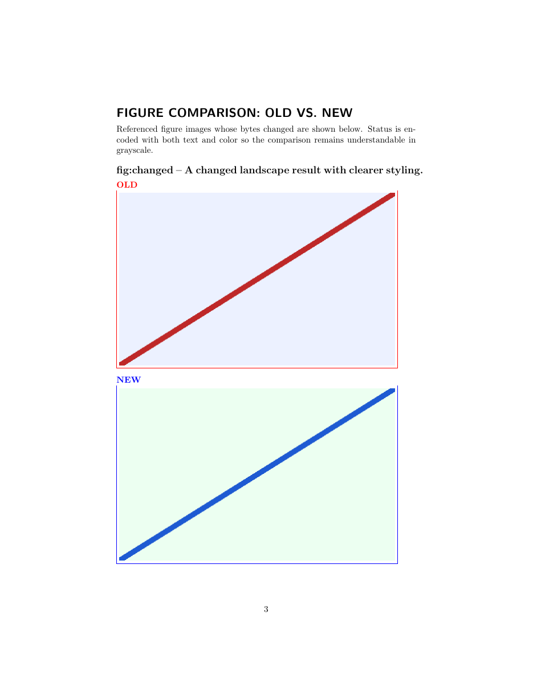

# TeXDelta

[](https://github.com/key-r-code/TeXDelta/actions/workflows/ci.yml)

TeXDelta creates review-ready LaTeX change PDFs with automatic old/new figure comparisons. It stages both projects in isolated workspaces, expands nested inputs and BibTeX bibliographies, runs `latexdiff`, and appends accessible comparisons for changed, added, and removed figures.

> Source preview: the command-line interface and file formats are versioned, but the internal Python API is not yet stable.



## Quick start

TeXDelta supports Python 3.9+, Linux or macOS, pdfLaTeX, and BibTeX. It diagnoses but never installs the external TeX tools it needs.

```console
python -m pip install .
texdelta doctor
texdelta diff path/to/old/main.tex path/to/new/main.tex
```

The default `texdelta-output/` directory contains:

- `diff.pdf`, the compiled review document;
- `diff.tex`, a rebuildable flattened source;
- `report.json`, a versioned machine-readable report;
- `latexmkrc` and `support/`, the local files needed to rebuild it.

Existing output is protected. Use `--force` to replace it or `--rebuild` to bypass a matching cached report.

```console
texdelta diff old/main.tex new/main.tex \
  --old-root old --new-root new \
  --output-dir review --style underline
```

Run `texdelta diff --help` for all options. See [configuration](docs/configuration.md) for figure-pair overrides and layout controls.

Exit code `2` indicates usage or configuration failure, `3` a toolchain or path-safety failure, `4` a document build failure, `5` an internal failure, and `130` an interrupted run.

## Figure comparisons

TeXDelta discovers referenced graphics inside `figure`, `figure*`, and `wrapfigure` environments. Nested `subfigure` panels are handled individually. It prioritizes byte identity over filenames, so a renamed but unchanged image is reported and omitted from the appendix. Ambiguous candidates remain separate additions and removals instead of being silently paired.

The generated appendix uses visible OLD, NEW, ADDED, and REMOVED markers in addition to color and distinct borders. Wide or tall comparisons stack automatically when side-by-side boxes would be too short.

## Overleaf

Create a bundled project that can run without installing the Python package:

```console
texdelta init-overleaf texdelta-overleaf
```

Upload that directory to Overleaf, replace the fixed `Old/` and `New/` examples, and recompile. Details and limitations are in the [Overleaf guide](docs/overleaf.md).

## Safety and scope

Input projects are treated as trusted local documents, not as hostile-code sandboxes. Shell escape is disabled unless `--allow-shell-escape` is explicitly supplied. Project symlinks and referenced user files may not escape their declared roots; installed TeX-system packages remain available.

The source preview intentionally defers Biber, XeLaTeX/LuaLaTeX, native Windows, container sandboxing, and Git-revision inputs. See [architecture](docs/architecture.md) and [troubleshooting](docs/troubleshooting.md).

## Contributing

Bug reports and contributions are welcome. Read [CONTRIBUTING.md](CONTRIBUTING.md), the [code of conduct](CODE_OF_CONDUCT.md), and the [security policy](SECURITY.md) first.

Released under the [MIT License](LICENSE).
